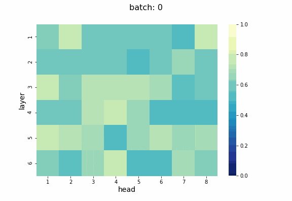

## Проект по реализации метода прунинга голов трансформера на основе статьи от [Voita et al.](https://www.aclweb.org/anthology/P19-1580/)
### В результате реализации был написан и обучен трансформер, на котором получено 26 bleu. После прунинга, из 48 голов осталось 29, при этом качество модели снизилось до 24 bleu.  
### Процесс среза голов можно видеть на анимации, на которой изображены изменения вероятности того, что голова не будет удалена. После того как порог вероятности достигает 0.5, голова срезается.
 
